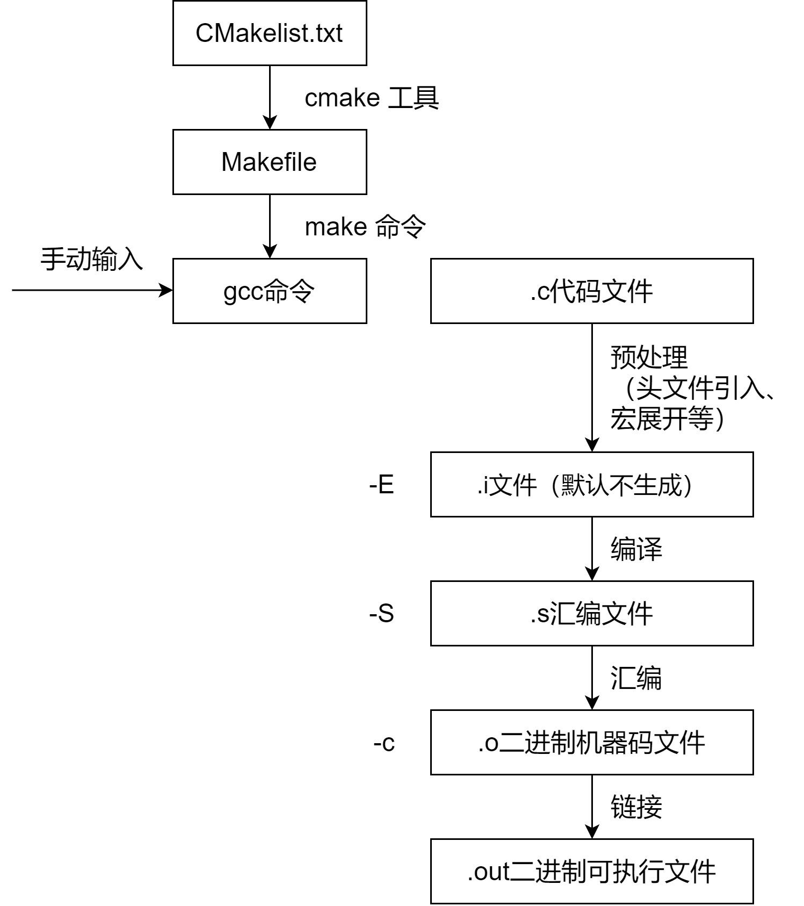

# 构建和编译

## 流程概述

`Cmake`、`make`命令、`gcc`编译器是一系列针对C语言（也有其他语言的拓展）构建和编译常用工具链。整套工具链的流程如图所示：



开发者需要编写`CMakelist.txt`文件，来配置项目相关的CMake参数。 通过运行`cmake`命令，自动生成对应平台的Make工具自动构建脚本`Makefile`文件。  `Makefile`文件可以看成是一系列**依赖于文件**的Shell命令。 它基于文件修改的**时间戳**来实现增量式处理。 具体规则大致如下，若生成的**目标文件**的时间戳早于**依赖文件**的时间戳时，则执行对应的命令，**重新生成**目标文件。 这实际上暗示了，Make工具不只用于编译，还可以用于其他的**增量式文件生成**任务。 使用Make工具来编译C/C++项目时，一般会使用Shell命令来调用`gcc`，**自动化**且**增量式**地实现C/C++源代码的编译链接等一系列工作。

使用`gcc`编译C/C++程序时，主要的编译流程如下，包含**预处理**、**编译**、**汇编**、**链接**等四个步骤。 以输入C语言程序源码文件`b.c`为例，直接调用命令`gcc b.c`，将会**完整执行**以下流程，并生成对应的**可执行**的**二进制**文件`a.out`。 注意，这里`gcc`的默认输出就是固定的`a.out`。 在GCC工具链中，汇编由工具`as`完成，链接则由工具`ld`完成。

对`gcc`使用以下指令，将会使其编译流程**停止**在对应位置：

- `-E`，（pr**E**processing），执行到**预处理**步骤之后，即处理C/C++源码中`#`开头的指令，包括**宏展开**以及`#include`**头文件引入**等等。 该指令默认不输出文件，可以使用`-o`指令输出约定后缀为`*.i`的文件。
- `-S`，（a**S**sembly），执行到**编译**步骤之后，生成汇编文件，但不生成二进制机器码。 该指令默认的输出文件后缀为`*.s`。
- `-c`，（**c**ompilation），执行到**汇编**步骤之后，调用工具`as`，从汇编码生成二进制机器码，但不进行链接。 该指令默认的输出文件后缀为`*.o`（**o**bject）。
- 不带以上参数调用`gcc`将会完整执行以上流程，即执行到到**链接**（linking）步骤之后。 链接步骤实际上调用链接工具`ld`来执行，会将源码生成的二进制文件，库文件，以及程序的启动部分进行组合，从而形成一个完整的二进制可执行文件。

特别的，使用指令`-o`（**o**utput），可以指定输出文件的名称。 例如`gcc b.c -o b.bin`，将生成可执行文件`b.bin`，而不是默认的`a.out`。

# Makefile

make命令执行时，需要一个Makefile文件，以告诉make命令需要怎么样的去编译和链接程序。

推荐教程：[跟我一起写Makefile文档 (seisman.github.io)](https://seisman.github.io/how-to-write-makefile/index.html)/[跟我一起写Makefile重制版 (github.com)](https://github.com/seisman/how-to-write-makefile)

## 文件语法

```
targets : prerequisites
    command
    ...
```

targets是文件名，以空格分开，可以使用通配符。一般来说，我们的目标基本上是一个文件，但也有可能是多个文件。

command是命令行，如果其不与`target: prerequisites`在一行，那么**必须以 `Tab` 键开头**；如果和prerequisites在一行，那么可以用分号做为分隔。如果命令太长，你可以使用反斜杠（ `\` ）作为换行符。
当依赖目标新于目标时，也就是当规则的目标需要被更新时，make会一条一条的执行其后的命令。需要注意的是，如果你要让上一条命令的结果应用在下一条命令时，你应该使用分号分隔这两条命令。

prerequisites也就是目标所依赖的文件（或依赖目标）。如果其中的某个文件要比目标文件要新，那么，目标就被认为是“过时的”，被认为是需要重生成的。

### 特殊符号

#### 命令行前的标注

- `-`：忽略命令的出错
- `@`：这个命令将不被make显示出来

#### 通配符

- `~`：当前用户的 `$HOME` 目录
- `*`：代替任意长度的字符串，如 `*.c` 表示所有后缀为c的文件
- `?`：代替一个字符

### 伪目标

“伪目标”并不是一个文件，只是一个标签，由于“伪目标”不是文件，所以make无法生成它的依赖关系和决定它是否要执行。我们只有通过显式地指明这个“目标”才能让其生效。当然，“伪目标”的取名不能和文件名重名，不然其就失去了“伪目标”的意义了。

使用`.PHONY`来向make指明一个目标是“伪目标”，无论该文件是否存在。例如最常见的clean：

```makefile
.PHONY : clean
clean :
    rm *.o temp
```

## 变量

变量在声明时需要给予初值，而在使用时，需要给在变量名前加上 `$` 符号，但最好用小括号 `()` 或是大括号 `{}` 把变量给包括起来。如果你要使用真实的 `$` 字符，那么你需要用 `$$` 来表示。

变量会在使用它的地方精确地展开，就像C/C++中的宏一样。

### 自动化变量

自动化变量把模式中所定义的一系列的文件自动地挨个取出。这种自动化变量只应出现在规则的命令中。

下面是所有的自动化变量及其说明：

- `$@` : 表示规则中的目标文件集。在模式规则中，如果有多个目标，那么， `$@` 就是匹配于目标中模式定义的集合。
- `$%` : 仅当目标是函数库文件中，表示规则中的目标成员名。例如，如果一个目标是 `foo.a(bar.o)` ，那么， `$%` 就是 `bar.o` ， `$@` 就是 `foo.a` 。如果目标不是函数库文件（Unix下是 `.a` ，Windows下是 `.lib` ），那么，其值为空。
- `$<` : 依赖目标中的第一个目标名字。如果依赖目标是以模式（即 `%` ）定义的，那么 `$<` 将是符合模式的一系列的文件集。注意，其是一个一个取出来的。
- `$?` : 所有比目标新的依赖目标的集合。以空格分隔。
- `$^` : 所有的依赖目标的集合。以空格分隔。如果在依赖目标中有多个重复的，那么这个变量会去除重复的依赖目标，只保留一份。
- `$+` : 这个变量很像 `$^` ，也是所有依赖目标的集合。只是它不去除重复的依赖目标。
- `$*` : 这个变量表示目标模式中 `%` 及其之前的部分。如果目标是 `dir/a.foo.b` ，并且目标的模式是 `a.%.b` ，那么， `$*` 的值就是 `dir/foo` 。这个变量对于构造有关联的文件名是比较有效。如果目标中没有模式的定义，那么 `$*` 也就不能被推导出，但是，如果目标文件的后缀是make所识别的，那么 `$*` 就是除了后缀的那一部分。例如：如果目标是 `foo.c` ，因为 `.c` 是make所能识别的后缀名，所以， `$*` 的值就是 `foo` 。这个特性是GNU make的，很有可能不兼容于其它版本的make，所以，你应该尽量避免使用 `$*` ，除非是在隐含规则或是静态模式中。如果目标中的后缀是make所不能识别的，那么 `$*` 就是空值。

## 函数

在 Makefile 中，`$(function arguments)` 的写法（也可使用大括号）用于函数调用。

**函数参考：[使用函数 — 跟我一起写Makefile (github.io)](https://seisman.github.io/how-to-write-makefile/functions.html)**

在这其中，有几个重要的常用函数：

- `foreach`函数
- `if`函数
- `call`函数：多参数传递（类似于C结构体）
- `origin`函数：获得变量的来源
- `shell`函数：新生成一个Shell程序来执行命令

初次之外，还有几类不同用途的函数：

- 字符串处理函数：
  - `patsubst`：模式字符串替换
  - `word`：按顺序取单词函数
- 文件名操作函数：`wildcard`等
- make命令控制函数：`error`、`warning`等

## 条件判断

- ```makefile
  # ifeq 判断两变量是否相同
  ifeq (condition1,condition2) 
  # ifneq 则效果相反
  	commands1
  else
  	commands2
  endif
  ```

- ```makefile
  # ifdef 测试一个变量是否有值（被声明过）
  foo = $(bar)
  ifdef foo
  # ifndef 则效果相反
      frobozz = yes
  else
      frobozz = no
  endif
  ```

# Make命令

## 指定Makefile文件

GNU make找寻默认的Makefile的规则是在当前目录下依次找三个文件：`GNUmakefile`、`makefile`和`Makefile`。

当前，我们也可以给make命令指定一个特殊名字的Makefile。要达到这个功能，我们要使用make的 `-f` 或是 `--file` 参数（ `--makefile` 参数也行）。例如，我们有个makefile的名字是“hchen.mk”，那么，我们可以这样来让make来执行这个文件：

```shell
make –f hchen.mk
```

# 参考资料

[GCC/Make/CMake 之 GCC - 知乎 (zhihu.com)](https://zhuanlan.zhihu.com/p/342151242)

[GNU make](https://www.gnu.org/software/make/manual/make.html)

