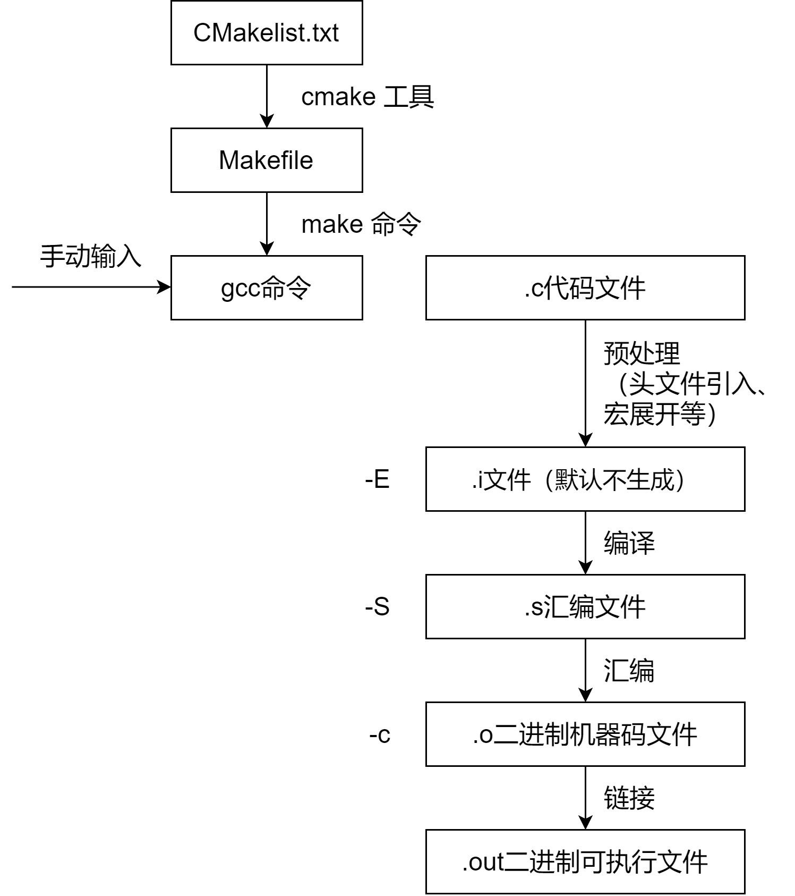

# 构建和编译

## 流程概述

`Cmake`、`make`命令、`gcc`编译器是一系列针对C语言（也有其他语言的拓展）构建和编译常用工具链。整套工具链的流程如图所示：

开发者需要编写`CMakelist.txt`文件，来配置项目相关的CMake参数。 通过运行`cmake`命令，自动生成对应平台的Make工具自动构建脚本`Makefile`文件。  `Makefile`文件可以看成是一系列**依赖于文件**的Shell命令。 它基于文件修改的**时间戳**来实现增量式处理。 具体规则大致如下，若生成的**目标文件**的时间戳早于**依赖文件**的时间戳时，则执行对应的命令，**重新生成**目标文件。 这实际上暗示了，Make工具不只用于编译，还可以用于其他的**增量式文件生成**任务。 使用Make工具来编译C/C++项目时，一般会使用Shell命令来调用`gcc`，**自动化**且**增量式**地实现C/C++源代码的编译链接等一系列工作。

使用`gcc`编译C/C++程序时，主要的编译流程如下，包含**预处理**、**编译**、**汇编**、**链接**等四个步骤。 以输入C语言程序源码文件`b.c`为例，直接调用命令`gcc b.c`，将会**完整执行**以下流程，并生成对应的**可执行**的**二进制**文件`a.out`。 注意，这里`gcc`的默认输出就是固定的`a.out`。 在GCC工具链中，汇编由工具`as`完成，链接则由工具`ld`完成。

对`gcc`使用以下指令，将会使其编译流程**停止**在对应位置：

- `-E`，（pr**E**processing），执行到**预处理**步骤之后，即处理C/C++源码中`#`开头的指令，包括**宏展开**以及`#include`**头文件引入**等等。 该指令默认不输出文件，可以使用`-o`指令输出约定后缀为`*.i`的文件。
- `-S`，（a**S**sembly），执行到**编译**步骤之后，生成汇编文件，但不生成二进制机器码。 该指令默认的输出文件后缀为`*.s`。
- `-c`，（**c**ompilation），执行到**汇编**步骤之后，调用工具`as`，从汇编码生成二进制机器码，但不进行链接。 该指令默认的输出文件后缀为`*.o`（**o**bject）。
- 不带以上参数调用`gcc`将会完整执行以上流程，即执行到到**链接**（linking）步骤之后。 链接步骤实际上调用链接工具`ld`来执行，会将源码生成的二进制文件，库文件，以及程序的启动部分进行组合，从而形成一个完整的二进制可执行文件。

特别的，使用指令`-o`（**o**utput），可以指定输出文件的名称。 例如`gcc b.c -o b.bin`，将生成可执行文件`b.bin`，而不是默认的`a.out`。

# 参考资料

[GCC/Make/CMake 之 GCC - 知乎 (zhihu.com)](https://zhuanlan.zhihu.com/p/342151242)
