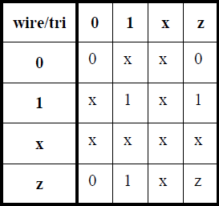
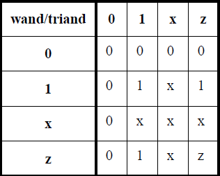
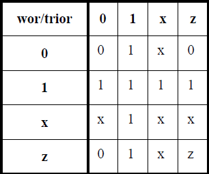

# 前言

`Verilog` 作为一门硬件描述语言，应用十分广泛。但是无论是[HDLBits (01xz.net)](https://hdlbits.01xz.net/wiki/Main_Page)还是有关的教材，`Verilog`相较于C语言等程序设计语言，对我个人来说，有以下几个体会：

- 除了基础电路单元以外，设计方法等相关内容过于零碎化
- 很多HDL语言的细节处理尚不清楚，难以分辨合法使用的界限
- 不清楚verilog语言对应的FPGA/ASIC资源的综合原理，导致不清楚某些语法功能的结合是否能正常运行
- 有时候会因为自己的项目界限导致语言上的“信息茧房”，难以提升自己对HDL的综合理解

因此，我个人认为自己需要一次权威的、标准的、有系统结构性的对IEEE verilog标准的学习，以期跳出所谓的硬件入门阶段。

**`IEEE Standard for Verilog Hardware Description Language`** 是IEEE牵头指定的、Xilinx等企业参与制定的verilog语言标准。较新的、常用的为2005年版（由于年份情况，在网上常见的是pdf文件）。该标准不像高级设计语言标准更新周期短，长期未做变更。

# 总体结构·目录

HDL不能轻易地用程序设计语言的思路和框架去套，这也是HDL相对难以系统掌握的重要原因（也很难找到关于其的描述，往往学生学到verilog这步鉴于学生能力和课程关系均为自学，就会导致不同于课本教授，导致依赖HDLBits、菜鸟教程等网络学习方法，见效快但零碎、路子野，导致认识不全面、掌握不够深）。

标准文档有以下章节，可以以此作为参考：

1. 概览 (Overview)
2. 参考文献 (Normative references)
3. 词法约定 (Lexical conventions)
4. 数据类型 (Data types)
5. 表达式 (Expressions)
6. 电路布置 (Assignments)
7. 门和开关级建模 (Gate- and switch-level modeling)
8. 用户定义的原语 (User-defined primitives, UDPs)
9. 行为建模 (Behavioral modeling)
10. 任务和函数 (Tasks and functions)
11. 调度语义 (Scheduling semantics)
12. 层次结构 (Hierarchical structures)
13. 配置设计的内容 (Configuring the contents of a design)
14. 指定块 (Specify blocks)
15. 时序检查 (Timing checks)
16. 使用标准延迟格式（SDF）的反向注释 (Backannotation using the standard delay format)
17. 系统任务和方法 (System tasks and functions)
18. VCD时序信号储存文件 (Value change dump (VCD) files)
19. 编译器指令 (Compiler directives)
20. 编程语言接口（PLI）概述 (Programming language interface overview)

-------

26. Verilog过程接口（VPI）的使用 (Using Verilog procedural interface (VPI) routines)
27. VPI例程定义 (VPI routine definitions)
28. (Protected envelopes)

verilog按章节顺序由浅入深，部分内容说法比较抽象，有时难以翻译，需要进一步在细节上探究。

# 3 - 词法约定 (Lexical conventions)

词法符号（tokens）构成verilog程序的基本单元，包括空格、注释、运算符、数值、字符串、标识符（Identifier）和关键字（Keyword）。

部分与其他应用相关的词法直接在其他章节中涉及。

## 数值

### `x`和`z`

除了正常的数值约定，为了满足数字电路的相应信号表示需求，出现了两种位符号：

- `x_digit`：未知值，也常用`?`表示
- `z_digit`：高阻抗值

### 实数

浮点数和科学计数法在verilog中也有定义。

实数转换为整数时，应将实数四舍五入为最接近的整数，而不是截断实数。

## 字符串

在示例中，IEEE使用`[8*n:1]`的寄存器`reg`记录字符串，并可以通过vector的合并方法进行字符串的加法计算。

```verilog
module string_test;
reg [8*14:1] stringvar;
initial begin
    stringvar = "Hello world";
    $display("%s is stored as %h", stringvar,stringvar);
    stringvar = {stringvar,"!!!"};
    $display("%s is stored as %h", stringvar,stringvar);
end
endmodule
```

## 标识符（Identifier）

标识符一般是指变量等自定义内容的名称。

简单标识符（simple identifier）可以是字母、数字、美元符号 (`$`) 和下划线字符 (`_`) 的任意序列。
简单标识符的第一个字符不应是数字或`$`；可以是字母或下划线。标识符应区分大小写。

Escaped identifier用于避免简单标识符的命名约束，应以反斜线字符（`\`）开始，以空格（或制表符、换行符）结束。在这之间可以使用任意的ASCII符号。

## 属性（Attributes）

属性可以作为前缀出现在声明、模块项、语句或端口连接中，用于指定HDL 源代码中对象、语句和语句组的属性，这些属性可被各种工具（包括仿真器）用于控制工具的操作或行为。

属性的实例（调用）格式为`(* attr_spec { , attr_spec } *)`

`attr_spec`的格式为`attr_name [ = constant_expression ]`

如果没有特别为属性赋值，则其值应为 1。如果同一语言元素的同一属性名称被定义了多次，则应使用最后一次的属性值；禁止属性实例嵌套。

# 4 - 数据类型

## 网络类型

网络类型指实体（如门）之间的物理连接。网不能存储值（`trireg`除外）。

IEEE标准使用**真值表**规定了多个驱动器驱动同一网络时的冲突（其假设两驱动信号为相当的强度）：

| 网络类型             | 网络含义                     | 真值表                                                       | 备注                                                         |
| -------------------- | ---------------------------- | ------------------------------------------------------------ | ------------------------------------------------------------ |
| `wire`和`tri`        | 普通网络                     |  | 还有提供了弱上拉的`tri1`和若下拉`tri0`，在驱动器均为高阻态的情况提供数字信号 |
| `wand`和`triand`     | 与网络                       |  | 下拉驱动优先                                                 |
| `wor`和`trior`       | 或网络                       |  | 上拉驱动优先                                                 |
| `uwire`              | unresolved or unidriver wire |                                                              | 仅允许提供单个驱动器                                         |
| `supply0`和`supply1` | 电源供应网络                 |                                                              |                                                              |

### `Trireg`

分为被驱动状态（Driven state）和电容状态（Capacitive state）。在`Trireg`的所有驱动器均为高阻态时保留之前驱动器提供的信号值。

## 变量类型

变量是数据存储元素的抽象。verilog语言提供了以下几种存储变量的数据类型。

| 数据类型   | 实际含义 | 初始值    | 备注                                                         |
| ---------- | -------- | --------- | ------------------------------------------------------------ |
| `reg`      | 寄存器   | 未知值`x` | 可后缀使用修饰符`signed`；<br/>对边沿敏感的存储元件（如触发器）和对电平敏感的存储元件（如复位置位和透明锁存器）都可以建模。 |
| `integer`  | 整数     | 未知值`x` | 整数是一种通用变量，用于操作不被视为硬件寄存器的量。         |
| `real`     | 实数     |           |                                                              |
| `time`     | 时间     | 未知值`x` | 时间变量用于存储和处理需要时序检查的仿真时间量，也可用于诊断和调试。这种数据类型通常与$time 系统函数结合使用（见 17.7.1）。 |
| `realtime` |          |           | 用实数的格式记录时间                                         |

**并非所有 Verilog HDL 运算符都可用于实数值**。实数变量在声明中**不得使用范围**（即使用`[a:b]`）。

对实数和实数变量使用逻辑运算符或关系运算符的结果是1 bit的标量值。

## 其它内容

### 强度（Strengths）

分为充电强度（charge strength）和驱动强度（drive strength）。

### 数组（Array)

在声明数组时，应在声明的标识符**后**指定元素地址**范围**。如：

```verilog
reg x[11:0]; 			// scalar reg
wire [0:7] y[5:0]; 		// 8-bit-wide vector wire indexed from 0 to 7
reg [31:0] x [127:0]; 	// 32-bit-wide reg
```

要为数组元素赋值，必须指定每个维度的索引。

# 参考

- [VerilogQuickRef.pdf (stanford.edu)](https://web.stanford.edu/class/ee183/handouts_win2003/VerilogQuickRef.pdf) 斯坦福的verilog速通小册子
- [About EE109 | Digital Systems Design Lab (kelayamatoz.github.io)](https://kelayamatoz.github.io/Digital-Systems-Design-Lab/)

