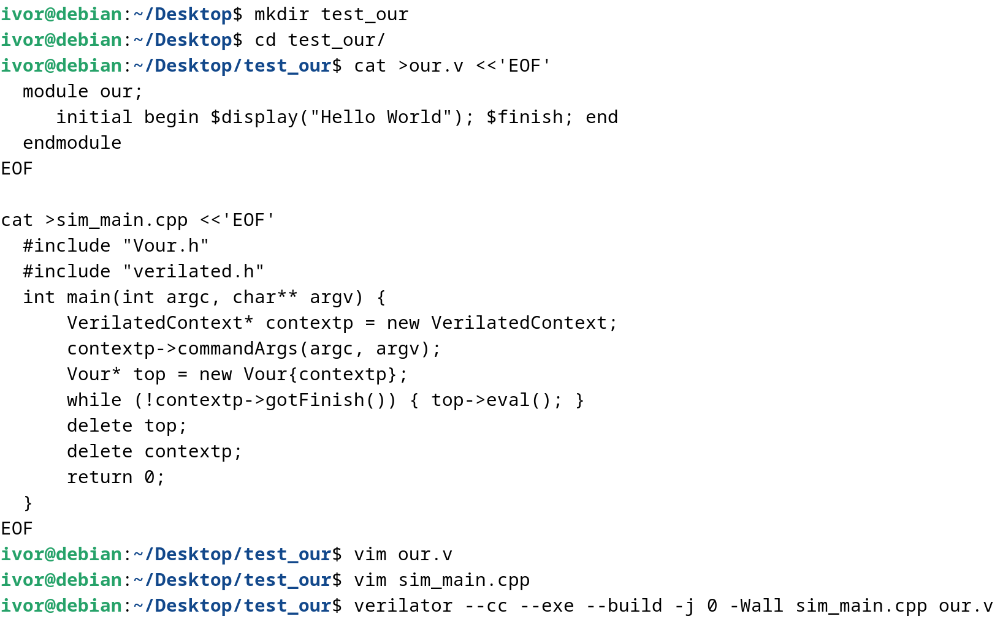
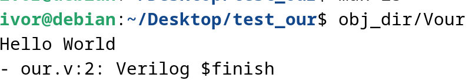
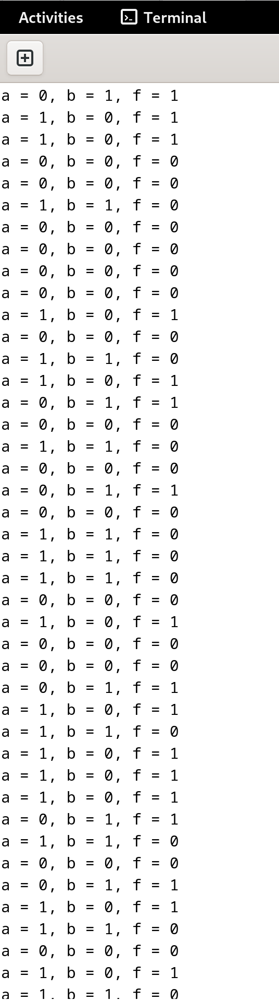
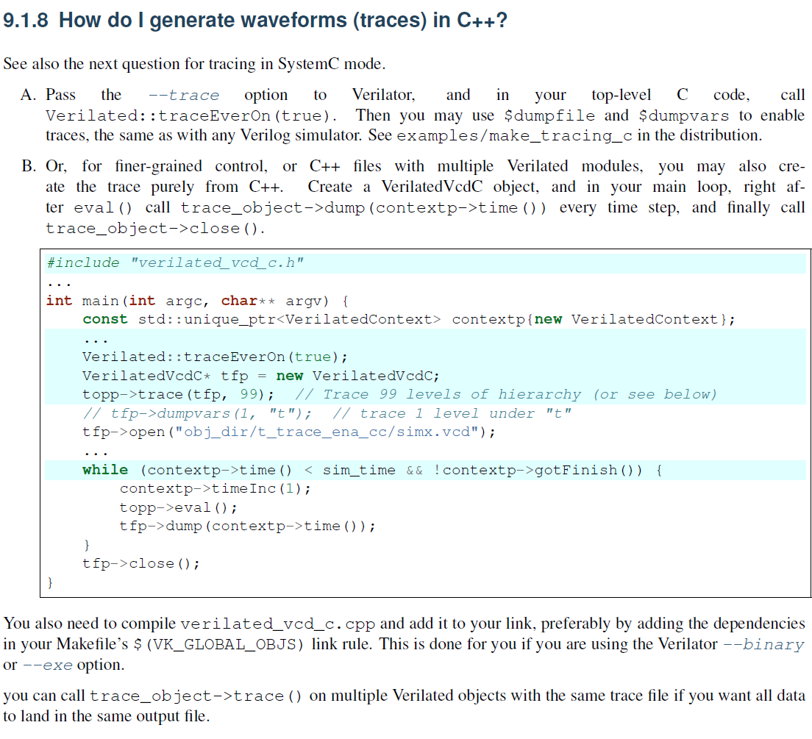

# 环境

- 虚拟机：VMware Workstation Pro 16
- 系统：Debian 12.2

# 6 - 搭建verilator仿真环境

## 安装verilator

### 下载源代码

github网页：[verilator/verilator: Verilator open-source SystemVerilog simulator and lint system (github.com)](https://github.com/verilator/verilator)

官方下载指南：[Installation — Verilator 5.016 documentation](https://verilator.org/guide/latest/install.html)

需要下载、安装的包：

```shell
sudo apt-get install git help2man perl python3 make autoconf g++ flex bison ccache
```

通过`git tag`查看版本之后结果是一长串，通过`git checkout v5.008`切换版本之后构造加编译。

`make`时间很长，建议`-j`多内核开跑（经历了全部拉满卡死的情况）

### 运行示例

#### 官方简单示例

官网示例内容：[Example C++ Execution — Verilator 5.016 documentation](https://verilator.org/guide/latest/example_cc.html#example-c-execution)

我一开始没注意到，但是左侧分栏的**GETTING STARTED**内的**Examples**还是比较显眼的。

过程：



运行结果：



#### ysyx示例

代码：

```cpp
#include "Vtop.h"
#include "verilated.h"
#include <stdio.h>
#include <stdlib.h>
#include <assert.h>

int main(int argc, char **argv)
{
  VerilatedContext *contextp = new VerilatedContext;
  contextp->commandArgs(argc, argv);
  Vtop *p_top = new Vtop{contextp};
  while (!contextp->gotFinish())
  {
    int a = rand() & 1;
    int b = rand() & 1;
    p_top->a = a;
    p_top->b = b;
    p_top->eval();
    printf("a = %d, b = %d, f = %d\n", a, b, p_top->f);
    assert(p_top->f == (a ^ b));
  }
  delete p_top;
  delete contextp;
  return 0;
}
```

过程总结：

- `Vtop.h`是`Module top`生成的头文件，因此名字要对应，下面的“结构体/对象"也要相应地用`V+模块名`调用。

- `obj_dir/Vtop___024root__DepSet_heccd7ead__0.cpp`关键内容：

  ```cpp
  VL_INLINE_OPT void Vtop___024root___ico_sequent__TOP__0(Vtop___024root* vlSelf) {
      if (false && vlSelf) {}  // Prevent unused
      Vtop__Syms* const __restrict vlSymsp VL_ATTR_UNUSED = vlSelf->vlSymsp;
      VL_DEBUG_IF(VL_DBG_MSGF("+    Vtop___024root___ico_sequent__TOP__0\n"); );
      // Body
      vlSelf->f = ((IData)(vlSelf->a) ^ (IData)(vlSelf->b));
  }
  ```

仿真输出：



### 打印并查看波形

#### tracing配置

verilator手册中已经介绍了波形生成的方法：



其中，A方法两个变量设置指的是：

```verilog
initial
begin            
    $dumpfile("wave.vcd");        //生成的vcd文件名称
    $dumpvars(0, led_demo_tb);    //tb模块名称
end
```

#### GTKwave

使用直接命令行中敲入`gtkwave +vcd文件名`即可解析开启波形显示。

### Makefile
