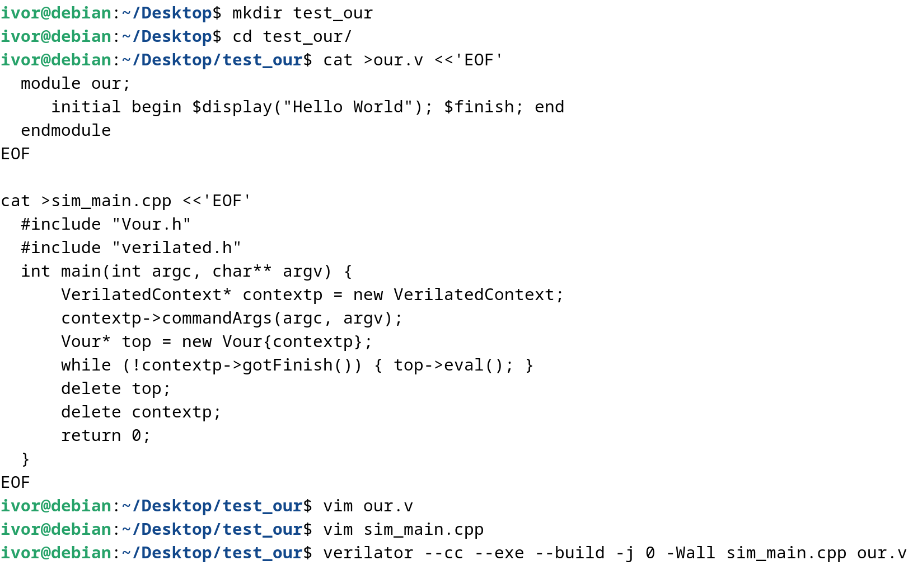
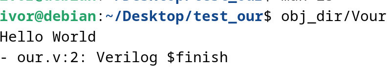
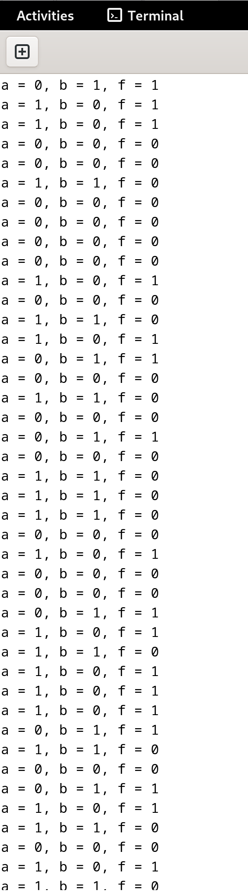

# 环境

- 虚拟机：VMware Workstation Pro 16
- 系统：Debian 12.2

# 6 - 搭建verilator仿真环境

## 安装verilator

### 下载源代码

github网页：[verilator/verilator: Verilator open-source SystemVerilog simulator and lint system (github.com)](https://github.com/verilator/verilator)

官方下载指南：[Installation — Verilator 5.016 documentation](https://verilator.org/guide/latest/install.html)

需要下载、安装的包：

```shell
sudo apt-get install git help2man perl python3 make autoconf g++ flex bison ccache
```

通过`git tag`查看版本之后结果是一长串，通过`git checkout v5.008`切换版本之后构造加编译。

`make`时间很长，建议`-j`多内核开跑（经历了全部拉满卡死的情况）

### 运行示例

#### 官方简单示例

官网示例内容：[Example C++ Execution — Verilator 5.016 documentation](https://verilator.org/guide/latest/example_cc.html#example-c-execution)

我一开始没注意到，但是左侧分栏的**GETTING STARTED**内的**Examples**还是比较显眼的。

过程：



运行结果：



#### ysyx示例

代码：

```cpp
#include "Vtop.h"
#include "verilated.h"
#include <stdio.h>
#include <stdlib.h>
#include <assert.h>

int main(int argc, char **argv)
{
  VerilatedContext *contextp = new VerilatedContext;
  contextp->commandArgs(argc, argv);
  Vtop *p_top = new Vtop{contextp};
  while (!contextp->gotFinish())
  {
    int a = rand() & 1;
    int b = rand() & 1;
    p_top->a = a;
    p_top->b = b;
    p_top->eval();
    printf("a = %d, b = %d, f = %d\n", a, b, p_top->f);
    assert(p_top->f == (a ^ b));
  }
  delete p_top;
  delete contextp;
  return 0;
}
```

过程总结：

- `Vtop.h`是`Module top`生成的头文件，因此名字要对应，下面的“结构体/对象"也要相应地用`V+模块名`调用。

- `Vtop.cpp`内容：

  ```cpp
  // Verilated -*- C++ -*-
  // DESCRIPTION: Verilator output: Model implementation (design independent parts)
  
  #include "Vtop.h"
  #include "Vtop__Syms.h"
  
  //============================================================
  // Constructors
  
  Vtop::Vtop(VerilatedContext* _vcontextp__, const char* _vcname__)
      : VerilatedModel{*_vcontextp__}
      , vlSymsp{new Vtop__Syms(contextp(), _vcname__, this)}
      , a{vlSymsp->TOP.a}
      , b{vlSymsp->TOP.b}
      , f{vlSymsp->TOP.f}
      , rootp{&(vlSymsp->TOP)}
  {
      // Register model with the context
      contextp()->addModel(this);
  }
  
  Vtop::Vtop(const char* _vcname__)
      : Vtop(Verilated::threadContextp(), _vcname__)
  {
  }
  
  //============================================================
  // Destructor
  
  Vtop::~Vtop() {
      delete vlSymsp;
  }
  
  //============================================================
  // Evaluation function
  
  #ifdef VL_DEBUG
  void Vtop___024root___eval_debug_assertions(Vtop___024root* vlSelf);
  #endif  // VL_DEBUG
  void Vtop___024root___eval_static(Vtop___024root* vlSelf);
  void Vtop___024root___eval_initial(Vtop___024root* vlSelf);
  void Vtop___024root___eval_settle(Vtop___024root* vlSelf);
  void Vtop___024root___eval(Vtop___024root* vlSelf);
  
  void Vtop::eval_step() {
      VL_DEBUG_IF(VL_DBG_MSGF("+++++TOP Evaluate Vtop::eval_step\n"); );
  #ifdef VL_DEBUG
      // Debug assertions
      Vtop___024root___eval_debug_assertions(&(vlSymsp->TOP));
  #endif  // VL_DEBUG
      vlSymsp->__Vm_deleter.deleteAll();
      if (VL_UNLIKELY(!vlSymsp->__Vm_didInit)) {
          vlSymsp->__Vm_didInit = true;
          VL_DEBUG_IF(VL_DBG_MSGF("+ Initial\n"););
          Vtop___024root___eval_static(&(vlSymsp->TOP));
          Vtop___024root___eval_initial(&(vlSymsp->TOP));
          Vtop___024root___eval_settle(&(vlSymsp->TOP));
      }
      // MTask 0 start
      VL_DEBUG_IF(VL_DBG_MSGF("MTask0 starting\n"););
      Verilated::mtaskId(0);
      VL_DEBUG_IF(VL_DBG_MSGF("+ Eval\n"););
      Vtop___024root___eval(&(vlSymsp->TOP));
      // Evaluate cleanup
      Verilated::endOfThreadMTask(vlSymsp->__Vm_evalMsgQp);
      Verilated::endOfEval(vlSymsp->__Vm_evalMsgQp);
  }
  
  //============================================================
  // Events and timing
  bool Vtop::eventsPending() { return false; }
  
  uint64_t Vtop::nextTimeSlot() {
      VL_FATAL_MT(__FILE__, __LINE__, "", "%Error: No delays in the design");
      return 0;
  }
  
  //============================================================
  // Utilities
  
  const char* Vtop::name() const {
      return vlSymsp->name();
  }
  
  //============================================================
  // Invoke final blocks
  
  void Vtop___024root___eval_final(Vtop___024root* vlSelf);
  
  VL_ATTR_COLD void Vtop::final() {
      Vtop___024root___eval_final(&(vlSymsp->TOP));
  }
  
  //============================================================
  // Implementations of abstract methods from VerilatedModel
  
  const char* Vtop::hierName() const { return vlSymsp->name(); }
  const char* Vtop::modelName() const { return "Vtop"; }
  unsigned Vtop::threads() const { return 1; }
  
  ```

  

仿真输出：



